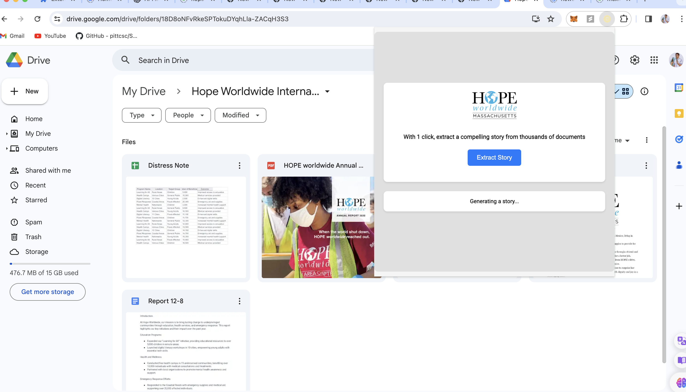
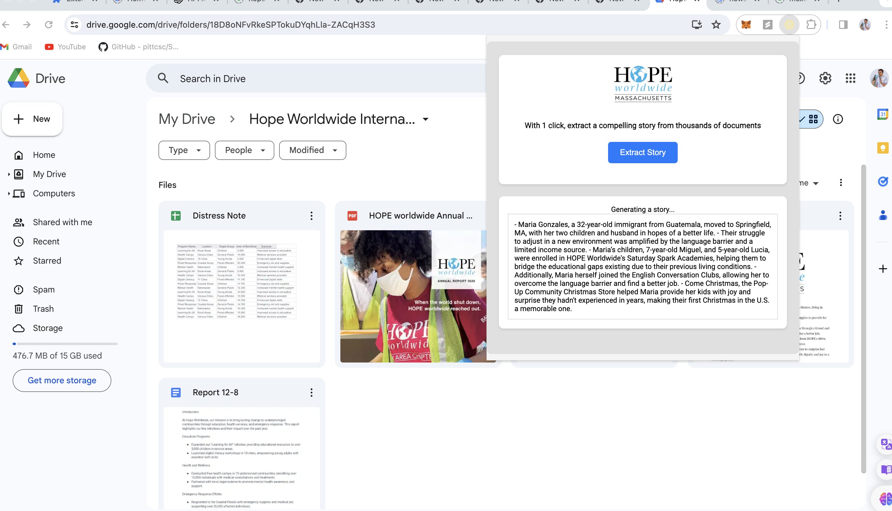

# DeisHack Chrome Extension

## Installing

> Node >= 14.18.0

```bash
# use npm-create command, or use pnpm | yarn
λ npm create chrome-ext

# or use npx command
λ npx create-chrome-ext

# or use npm-init command
λ npm init chrome-ext
```

## Usage

You can also directly specify the project name and the template you want to use via additional command line options. For example, to scaffold a Vite + Svelte project, run:

```bash
# npm 6.x
λ npm create chrome-ext@latest my-crx-app --template svelte-js

# or npm 7+, extra double-dash is needed:
λ npm create chrome-ext@latest my-crx-app -- --template react-ts

# or yarn
λ yarn create chrome-ext my-crx-app --template vue-ts

# or pnpm
λ pnpm create chrome-ext my-crx-app --template vanilla-ts
```

You can also generator the project with `crx` cli, run:

```bash
λ npm install create-chrome-ext --global

# and then
λ crx my-crx-app
# or
λ crx my-crx-app --template preact-js
# or use create-chrome-exe (global env)
λ create-chrome-ext my-crx-app
```

## Preview



